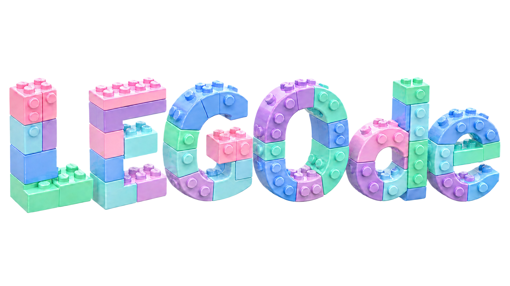

# LEGOde



LEGOde is a typed Python toolbox for assembling reusable numerical terms into
implicit ordinary differential equations:

```text
LHS(t, y, y_dot, parameters) = RHS(t, y, y_dot, parameters)
```

It validates and assembles named equations, then solves the implicit residual
for `y_dot` behind a callable accepted by SciPy's `solve_ivp`.


## Quick start

```python
from dataclasses import dataclass

import numpy as np
from scipy.integrate import solve_ivp

from legode import Force, ODEEnsemble, ODEEquation


@dataclass(frozen=True)
class OscillatorParameters:
    mass: float
    stiffness: float


class PositionDerivative(Force[OscillatorParameters]):
    required_derivatives = ("position",)

    def __call__(self, t, y, y_dot, layout):
        return y_dot[layout["position"]]


class Velocity(Force[OscillatorParameters]):
    required_states = ("velocity",)

    def __call__(self, t, y, y_dot, layout):
        return y[layout["velocity"]]


class MomentumDerivative(Force[OscillatorParameters]):
    required_derivatives = ("velocity",)

    def __call__(self, t, y, y_dot, layout):
        return self.params.mass * y_dot[layout["velocity"]]


class SpringForce(Force[OscillatorParameters]):
    required_states = ("position",)

    def __call__(self, t, y, y_dot, layout):
        return -self.params.stiffness * y[layout["position"]]


params = OscillatorParameters(mass=1.0, stiffness=4.0)
equations = [
    ODEEquation(
        solves_for=("position",),
        lhs=PositionDerivative(params),
        rhs=Velocity(params),
    ),
    ODEEquation(
        solves_for=("velocity",),
        lhs=MomentumDerivative(params),
        rhs=SpringForce(params),
    ),
]
system = ODEEnsemble(equations)

# State order is derived from equation declaration order.
y0 = system.layout.vector({"position": 1.0, "velocity": 0.0})
rhs = system.as_scipy_rhs()
solution = solve_ivp(rhs, (0.0, 10.0), y0)
```

Each `as_scipy_rhs()` result is stateful: it reuses the previous successful
derivative as the next nonlinear root solve's initial guess. Use a separate
adapter per concurrent integration, or call `reset()` before reuse. A derivative
is accepted when its residual norm is below the configurable `residual_tol`,
even if SciPy's progress flag is pessimistic near machine precision.

## Typed parameter files

JSON objects can be recursively converted into parameter dataclasses. Annotated
NumPy arrays are constructed from JSON arrays; an optional field dtype can be
specified with `field(metadata={"dtype": "float64"})`.

```python
from dataclasses import dataclass, field
import numpy as np
from legode import load_params

@dataclass
class Parameters:
    gains: np.ndarray = field(metadata={"dtype": "float64"})

params = load_params("parameters.json", Parameters)
```

JSON is built in. Additional formats can be added with
`register_config_loader(".toml", loader)`; a loader receives a `Path` and returns
a mapping.

## Studies

Notebook-like scripts live in [`notebooks`](notebooks/README.md). The Duffing
study builds exact and Kriging-surrogate systems with LEGOde, solves both
through SciPy, and tracks physical residual against the number of exact
right-hand-side training evaluations.
